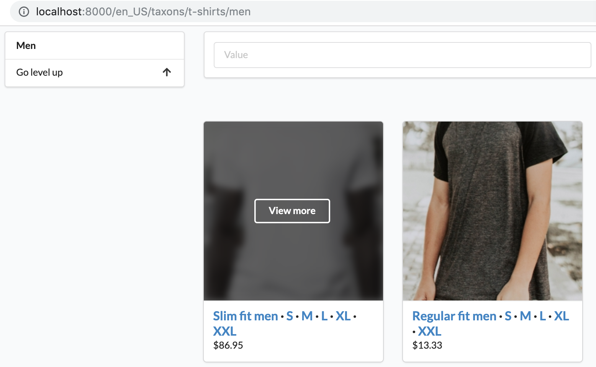
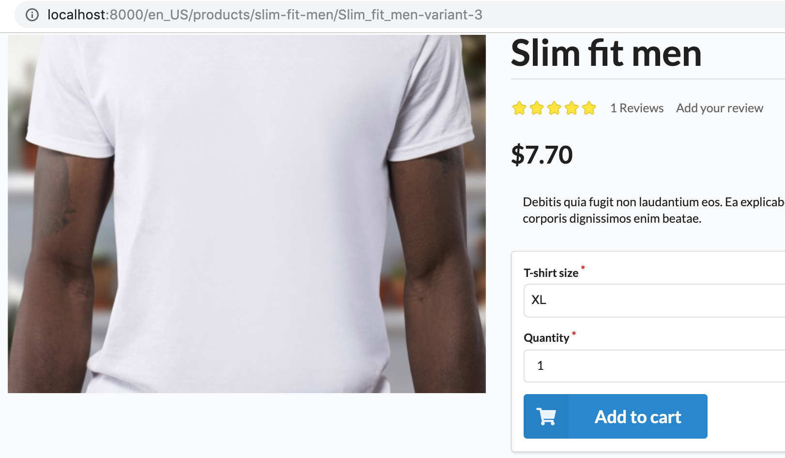

# Sylius Variant Link Plugin

[![Latest Version on Packagist][ico-version]][link-packagist]
[![Software License][ico-license]](LICENSE)
[![Build Status][ico-travis]][link-travis]
[![Quality Score][ico-code-quality]][link-code-quality]

In a standard Sylius shop it is not possible to link directly to variants. That problem is what this plugin solves.

## Screenshots

<details><summary>CLICK TO SEE</summary>





</details>

## Installation

### Step 1: Download the plugin

Open a command console, enter your project directory and execute the following command to download the latest stable version of this bundle:

```bash
$ composer require setono/sylius-variant-link-plugin
```

This command requires you to have Composer installed globally, as explained in the [installation chapter](https://getcomposer.org/doc/00-intro.md) of the Composer documentation.


### Step 2: Enable the plugin

Then, enable the plugin by adding it to the list of registered plugins/bundles
in `config/bundles.php` file of your project:

```php
<?php

# config/bundles.php

return [
    // ...
    Setono\SyliusVariantLinkPlugin\SetonoSyliusVariantLinkPlugin::class => ['all' => true],
    // ...
];
```

### Step 3: Import routing

```yaml
# config/routes/setono_sylius_variant_link.yaml
setono_sylius_variant_link:
    resource: "@SetonoSyliusVariantLinkPlugin/Resources/config/routes.yaml"
```

### Step 4: Install assets
```bash
$ php bin/console assets:install
```

### Step 5: Override product show template
Start by copying the file `vendor/sylius/sylius/src/Sylius/Bundle/ShopBundle/Resources/views/Product/show.html.twig` to
`templates/bundles/SyliusShopBundle/Product/show.html.twig`

Here are two commands that will do just that (only do this if you haven't overridden this template yet):
```bash
$ mkdir -p templates/bundles/SyliusShopBundle/Product
$ cp vendor/sylius/sylius/src/Sylius/Bundle/ShopBundle/Resources/views/Product/show.html.twig templates/bundles/SyliusShopBundle/Product
```

In the template we need three things:
1. Include a template
2. Include a javascript file
3. Run a javascript function

**1. Include variant links template**

Add this twig line within the `content` block: ``

**2 and 3. Include javascript file and run function**

In the `javascripts` block append this:

```twig


<script>
    $(function() {
        $(document).variantLinks();
    });
</script>
```

See [this file](tests/Application/templates/bundles/SyliusShopBundle/Product/show.html.twig) for an example of these three changes.

## Usage

### Link to a variant

```twig
{# @var \Sylius\Component\Product\Model\ProductVariantInterface variant #}

{{ setono_variant_path(variant) }} {# Works as Symfonys path() function a returns an absolute path #}
{{ setono_variant_url(variant) }} {# Works as Symfonys url() function a returns an absolute url #}
```

See [example](tests/Application/templates/bundles/SyliusShopBundle/Product/_box.html.twig).

### View a product
If you have a product with slug `product-1` which has a variant with code `variant-code-1` the above twig statement will return
`/en_US/products/product-1/variant-code-1` on a default Sylius installation.

So try and go to that URL and you will see the respective variant is selected and the price is correct for the respective variant.

### Output variant values instead of product values
On the product show page (`/en_US/products/slug`) the product code is outputted, but let's say you want to output the variants
code instead. Then you just do it like this:

```twig
{{ (product|sylius_resolve_variant).code }}
```

If you want to do that multiple places you can of course set the product variant like so:

```twig


{{ variant.code }}
```

Easy peasy!

## Extending
### I want to use something else than variant code for the URL
Let's say you have a store with clothes and you want to use the size of clothes in the URL to determine the variant.
You want to end up with URLs like `/en_US/products/product-1/medium`.

To do this you need to implement two interfaces:
- [ProductVariantFromIdentifierResolverInterface](src/Resolver/ProductVariantFromIdentifierResolverInterface.php)
- [ProductVariantUrlGeneratorInterface](src/UrlGenerator/ProductVariantUrlGeneratorInterface.php)
 
**Implementing ProductVariantFromIdentifierResolverInterface**

```php
<?php
namespace App\Resolver;

use Setono\SyliusVariantLinkPlugin\Resolver\ProductVariantFromIdentifierResolverInterface;
use Sylius\Component\Core\Model\ProductInterface;
use Sylius\Component\Core\Model\ProductVariantInterface;

final class ProductVariantFromSizeResolver implements ProductVariantFromIdentifierResolverInterface
{
    public function resolve(ProductInterface $product, string $identifier) : ?ProductVariantInterface
    {
        foreach ($product->getVariants() as $variant) {
            foreach ($variant->getOptionValues() as $optionValue) {
                if(strtolower($optionValue->getValue()) === $identifier) {
                    return $variant;
                }
            }
        }
        
        return null;
    }
}
```

Now define the service:

```xml
<?xml version="1.0" encoding="UTF-8" ?>

<container xmlns:xsi="http://www.w3.org/2001/XMLSchema-instance" xmlns="http://symfony.com/schema/dic/services"
           xsi:schemaLocation="http://symfony.com/schema/dic/services http://symfony.com/schema/dic/services/services-1.0.xsd">
    <services>
        <service id="Setono\SyliusVariantLinkPlugin\Resolver\ProductVariantFromIdentifierResolverInterface"
                 alias="app.resolver.product_variant_from_size"/>

        <service id="app.resolver.product_variant_from_size" class="App\Resolver\ProductVariantFromSizeResolver"/>
    </services>
</container>
```

**Implementing ProductVariantUrlGeneratorInterface**

```php
<?php
namespace App\UrlGenerator;

use Setono\SyliusVariantLinkPlugin\UrlGenerator\ProductVariantUrlGeneratorInterface;
use Sylius\Component\Product\Model\ProductVariantInterface;
use Symfony\Component\Routing\Generator\UrlGeneratorInterface;

final class ProductVariantFromSizeUrlGenerator implements ProductVariantUrlGeneratorInterface
{
    /** @var UrlGeneratorInterface */
    private $urlGenerator;

    public function __construct(UrlGeneratorInterface $urlGenerator)
    {
        $this->urlGenerator = $urlGenerator;
    }
    
    public function generate(
        ProductVariantInterface $productVariant,
        array $parameters = [],
        int $referenceType = UrlGeneratorInterface::ABSOLUTE_PATH
    ) : string{
        $parameters = array_merge($parameters, [
            'slug' => $productVariant->getProduct()->getSlug(),
            'variant_identifier' => $productVariant->getOptionValues()->first()->getCode(),
        ]);

        return $this->urlGenerator->generate(
            'setono_sylius_variant_link_shop_product_variant_show', $parameters, $referenceType
        );
    }
}
```

Now define the service:

```xml
<?xml version="1.0" encoding="UTF-8" ?>

<container xmlns:xsi="http://www.w3.org/2001/XMLSchema-instance" xmlns="http://symfony.com/schema/dic/services"
           xsi:schemaLocation="http://symfony.com/schema/dic/services http://symfony.com/schema/dic/services/services-1.0.xsd">
    <services>
        <service id="Setono\SyliusVariantLinkPlugin\UrlGenerator\ProductVariantUrlGeneratorInterface"
                 alias="app.url_generator.product_variant_from_size"/>

        <service id="app.url_generator.product_variant_from_size" class="App\UrlGenerator\ProductVariantFromSizeUrlGenerator"/>
    </services>
</container>
```

Notice that if you're using autowiring you only need the aliases.

[ico-version]: https://img.shields.io/packagist/v/setono/sylius-variant-link-plugin.svg
[ico-license]: https://img.shields.io/badge/license-MIT-brightgreen.svg
[ico-travis]: https://travis-ci.com/Setono/SyliusVariantLinkPlugin.svg?branch=master
[ico-code-quality]: https://img.shields.io/scrutinizer/g/Setono/SyliusVariantLinkPlugin.svg

[link-packagist]: https://packagist.org/packages/setono/sylius-variant-link-plugin
[link-travis]: https://travis-ci.com/Setono/SyliusVariantLinkPlugin
[link-code-quality]: https://scrutinizer-ci.com/g/Setono/SyliusVariantLinkPlugin
